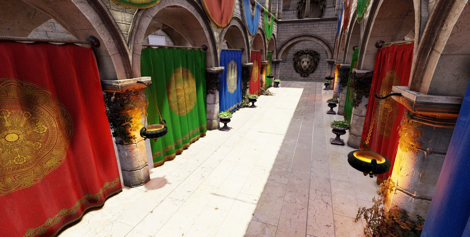

# AAAA Render Pipeline (Unity SRP)

🚧 An experimental Unity render pipeline.

The main goals of the project are:

- GPU Driven Rendering pipeline.
- Modern high-fidelity rendering techniques.
- Minimal reliance on temporal algorithms.
- Pushing technical constraints of Unity. 

### Unity and Graphics API Versions

> 🔨 Developed with Unity 6000.0.17f1.

> ❎ Only DirectX 12 is supported at the moment.

## Rendering Techniques

- GPU Driven pipeline
  - Hierarchical meshlet LODs
  - Frustum, Cone, and Occlusion Culling (Two-Pass)
- Visibility Buffer + GBuffer
- PBR lighting
  - Cook-Torrance BRDF
  - Image-Based Lighting
    - Irradiance and Pre-Filtered Environment maps generated from an HDR cubemap
- Cascaded Shadow Mapping
- PCF 5x5 Soft Shadows
- Clustered Lighting
- [XeGTAO](https://github.com/GameTechDev/XeGTAO)
  - Bent Normals
  - "Micro Shadowing": directional light contact shadow approximation
- HiZ SSR
- [SMAA](https://github.com/iryoku/smaa)
- [FSR 1.0](https://gpuopen.com/fidelityfx-superresolution/)
- ACES/Neutral Tonemapping

## API Features

- **ShaderModel 6.6 bindless resources (right here in Unity!)**
- In-Editor [PIX for Windows]((https://devblogs.microsoft.com/pix/)) integration

## Project Structure

- [Packages/com.deltation.aaaa-rp](./Packages/com.deltation.aaaa-rp): Unity SRP package.
- [DELTationBindlessPlugin](./DELTationBindlessPlugin): native Unity plugin providing support for bindless and PIX integration.

### External Dependencies

- [zeux/meshoptimizer](https://github.com/zeux/meshoptimizer): mesh simplification and meshlet generation.
- [KarypisLab/METIS](https://github.com/KarypisLab/METIS): graph partitioning.
